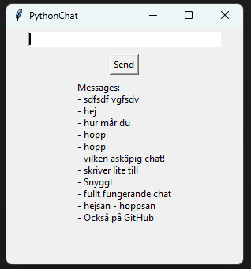

# PythonKurs_03_PythonChat

     <h1>Pythonprogrammering med AI-inriktning</h1>
     Vecka 3 / Lektionspass 3 / Onsdag 16/4, kl. 17:00-19:00
     Robin Kamo -> kakashidota
     <h4>Dagens Agenda</h4>
     
      # MongoDB
      ---- vi behöver data för att träna modeller
	  ----- MongoDB gör det enkelt att hantera stora mängder data
	  ----- MongoDB är ett bra alternativt om man snabbt vill bygga en modell
	  ----- Enkelt med Python, pythdb
	  ----- namnet Mongo kommer från Humongos
	  ----- CosmosDB kan köra med MongoDB
	  ----- MongoDB är en NoSQL / alltså ingen SQL-server
	  ----- Asure kan köra med MongoDB
	  ----- Fundamentalt att samla in data med maskinlörning
      ***** https://www.mongodb.com/products/tools/compass
      ----- Download / mongodb-compass-1.46.0-win32-x64 / install
      ***** https://www.mongodb.com/try/download/shell
     
      # Git och Github
	  ----- ett sätt att samarbeta
	  ----- ett sätt att programmera
	  ----- en byggsten i all progframmering
	  ----- GIT är ett versionshanteringssystem över tid
	  ----- kan alltid gå tillbaka till tidigare version
	  ----- team arbetar tillsammans i projekt, sparar i commits
	  ----- till 99% arbetar programmerare tillsammans med andra människor
      
      ----- Branches/Grenar *) Main/Master *) Staging *) Developping 
      ----- GIT är det lokala verktyget
      ----- GIThub är en molnbaserad plats där vi samarbetar
      ***** https://github.com/  
     
     <h4>Fyra användbara git-kommando</h4>
     &nbsp;&nbsp;&nbsp;&nbsp;&nbsp;&nbsp;&nbsp;&nbsp; # - 1) Behövs inte men visar senaste ändringarna
    &nbsp;&nbsp;&nbsp;&nbsp;&nbsp;&nbsp;&nbsp;&nbsp; <h4>git status</h4> (frivilligt)
     &nbsp;&nbsp;&nbsp;&nbsp;&nbsp;&nbsp;&nbsp;&nbsp; # - 2) Lägg till allt fr.o.m root till GitHub
    &nbsp;&nbsp;&nbsp;&nbsp;&nbsp;&nbsp;&nbsp;&nbsp; <h4>git add .</h4>
     &nbsp;&nbsp;&nbsp;&nbsp;&nbsp;&nbsp;&nbsp;&nbsp; # - 3) TxT som visas på GitHub för associerade file
    &nbsp;&nbsp;&nbsp;&nbsp;&nbsp;&nbsp;&nbsp;&nbsp; <h4>git commit  -m "TxT uppgift om sista.."</h4>
     &nbsp;&nbsp;&nbsp;&nbsp;&nbsp;&nbsp;&nbsp;&nbsp; # - 4) Pusha upp alla ändringar till GitHub
    &nbsp;&nbsp;&nbsp;&nbsp;&nbsp;&nbsp;&nbsp;&nbsp; <h4>git push</h4>
     
      # Ska vi bygga en Chat i Python med Tkinter och MongoDB
      ----- Börjar med enkelt program där en Chat skapas i Python
      ----- Kör MongoDB lokalt på PC'n, inkluderat i koden
      -----
      ----- <h4>pip install PyMongo</h4>
      ***** 
      ***** MongoDB Atlas - Molnbaserad databas som alla kan dela på  
      ***** ***** ***** ***** Skaffa ett gratiskonto ***** ***** 
      ***** 
      ----- Avslutning där alla distanselever kopplas upp mot MongoDB Atlas
      ----- Kursledarens adminkonto driftar uppgiften
      ----- Eleverna använder egna Chat klienter som byggts i Python

<h4>Figur: Python programmet PythonChat</h4>

